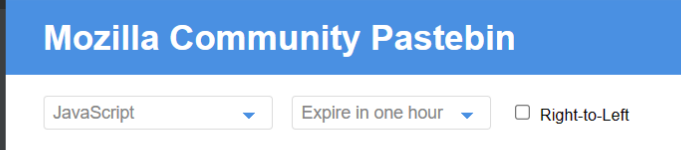

# 建议

## 关于Mod
1. 最好先把Java的基础打好再进行Mod的开发，否则在开发的过程中会遇到很多阻碍，可以在B站上随便找一个播放量比较高的视频进行，边看边学，可以不用全部看完，但一定要多上机操作，否则永远不会上手；
2. 在开发Mod之前，建议先把原版和其它一些Mod给玩明白，还有一些其它的游戏，以便在以后的开发中寻找灵感，并设计出更好的内容出来；
3. 开发Mod除了需要一定的Java知识之外，还要懂得如何绘制像素类型的贴图，因为在开发Mod的过程中，总会不可避免地需要用到诸如方块、物品以及生物之类的贴图，它是Mod中重要的一环。如果您现在还不会画贴图或者画贴图的水平不高，建议和一些贴图画得好的同伴进行合作，因为贴图的质量也是决定Mod质量的一部分；
4. 本开发教程不会讲述任何关于Java以及其它编程相关的基础内容及其原理。

## 关于编程
1. 编程需要一定的数学和英语基础，但是对于刚入门的人来说，对这两个技能的要求并不高，因此放心大胆地去做就是了；
2. 在向别人求助或者提问时，除了要保证自己的命名规范之外，还要尽可能详细地描述自己的问题，以便他人更快地解决问题；
3. 在刚开始开发的时候，可以先照着教程做，先不要考虑优化的事情，过早的优化会拖慢开发的速度、产生bug，甚至会出现反向优化的情况。在对Mod开发比较熟练之后，再考虑优化以及其它的东西。

## 关于开发工具
1. 开发使用的IDE：IntelliJ IDEA（使用Community版本即可）；
2. 推荐安装的插件：[Minecraft Development](https://plugins.jetbrains.com/plugin/index?xmlId=com.demonwav.minecraft-dev)，Mod开发必装的插件，有很多方便而又实用的功能。

## 说明
如果出现了什么报错的情况，需要求助时，一定要附上完整的运行日志，没有错误报告的求助，无异于闭门造车，特别说明：**只要能打开电脑，就不要拍屏！**&emsp;

- ### 如果您现在还不懂得截图怎么办？
1. **方法一**：打开QQ，然后按下 Ctrl+Alt+A，就会启动截图功能，截图之后保存到指定位置即可；
2. **方法二**：按下 Win+Shift+S，就会启动Windows自带的截图工具，截图完毕之后，右下角会弹出提示，点开之后选择保存即可；
3. **方法三（推荐）**：用Snipaste工具进行截图，[此工具可以在这里进行下载](https://zh.snipaste.com/)，下载完成之后，解压到一个空的文件夹，运行之后，按下F1即可进行截图。该工具还有其它的功能，请自行摸索。

- ### 如果您的错误报告内容太多，不方便截图怎么办？
此处推荐一个网站：[Mozilla Community Pastebin](https://paste.mozilla.org/)，此处以Java的报错为例：
1. 将您的报错内容或运行日志全部复制下来（建议全部复制下来，除非您知道错误就在这个地方）；
2. 如图下所示，左边的这个下拉框是选择语言的类型，如果是Java，那就把它改成Java；中间的是该内容的有效时间，默认是一个小时，可根据自身的实际情况进行修改，过了该时间后，内容将自动销毁。
3. 将报错内容复制到下面空白的方框中，然后点击右边的蓝色按钮（就是写着Paste Snippet的那个）；
4. 此时会发现，网页的链接已经发生了变化，然后复制该链接，并发送给你认为能解决你问题的人即可。在有效时间之内，该内容可被知道此链接的任何人看到；
#### **【说明：此类网站不止这一个，可自己去查找自己觉得更好用的】**
