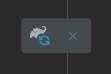

# Parchment

由于Mojang提供的官方映射表中并未提供形参的准确名字，这个工具就是用来补足官方表中的形参的，有能力的 [可以移步 GitHub 看原文](https://github.com/ParchmentMC/Librarian/blob/dev/docs/FORGEGRADLE.md)
\
\
听不懂没关系，展示一下效果就明白了：
 - 配置前：
   ```java
    public static VoxelShape box(double p_49797_, double p_49798_, double p_49799_, double p_49800_, double p_49801_, double p_49802_) {
        return Shapes.box(p_49797_ / 16.0D, p_49798_ / 16.0D, p_49799_ / 16.0D, p_49800_ / 16.0D, p_49801_ / 16.0D, p_49802_ / 16.0D);
    }    
   ```
 - 配置后：
   ```java
    public static VoxelShape box(double pX1, double pY1, double pZ1, double pX2, double pY2, double pZ2) {
        return Shapes.box(pX1 / 16.0D, pY1 / 16.0D, pZ1 / 16.0D, pX2 / 16.0D, pY2 / 16.0D, pZ2 / 16.0D);
    } 
   ```
   
## 配置方法
打开settings.gradle，添加如下内容：
```
pluginManagement {
    repositories {
        gradlePluginPortal()
        maven { url = 'https://maven.minecraftforge.net/' }
        //需要你添加的内容：
        maven { url = 'https://maven.parchmentmc.org' }
    }
}
```
打开build.gradle，添加如下内容：
```
plugins {
    id 'eclipse'
    id 'maven-publish'
    id 'net.minecraftforge.gradle' version '5.1.+'
    //需要你添加的内容：
    id 'org.parchmentmc.librarian.forgegradle' version '1.+'
}
```
```
minecraft {

    mappings channel: 'official', version: '1.19.2'
    将上面的代码删除，然后修改成下面这句：
    mappings channel: 'parchment', version: '1.18.2-2022.07.03-1.19.2'
    ....
    
}
```
最后点击这个按钮刷新一下gradle，等待即可（可能会失败，可以多试几次）：\
