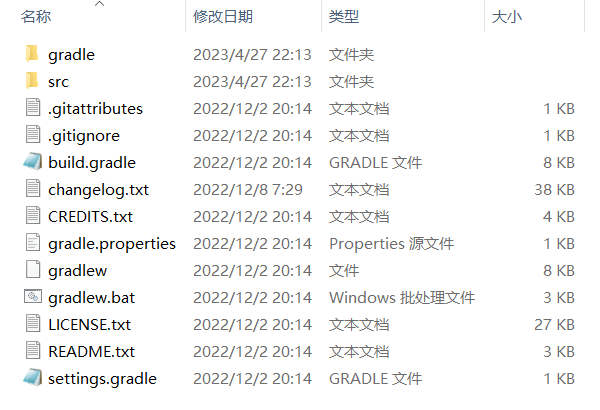
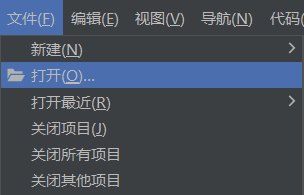
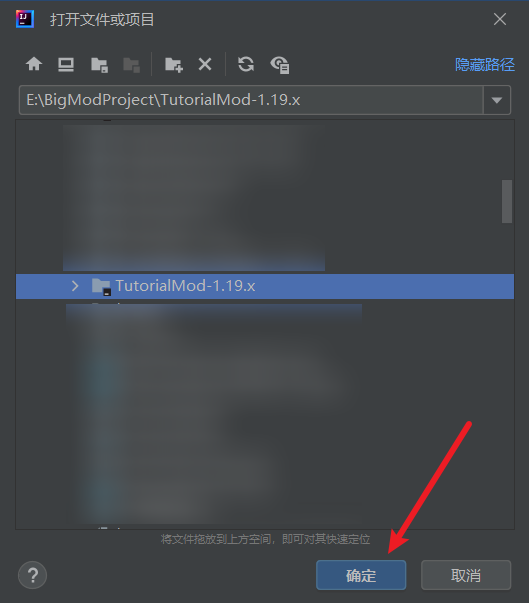
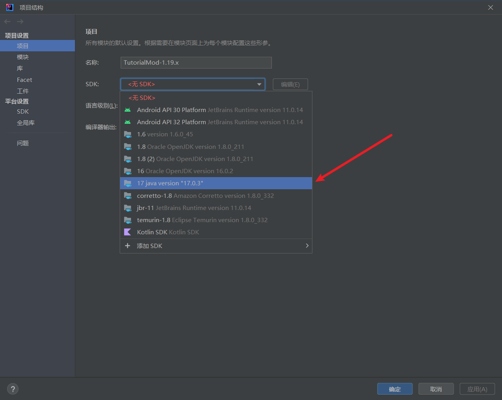
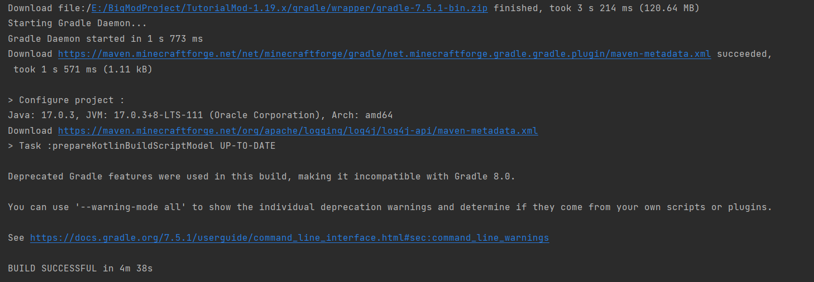
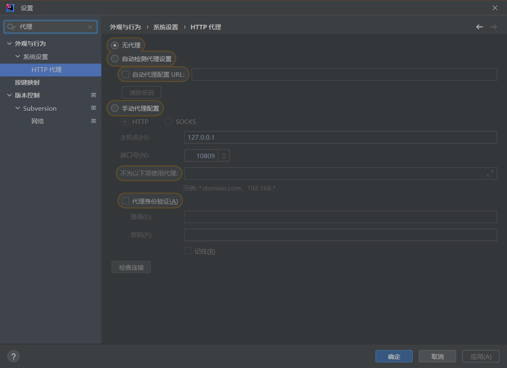
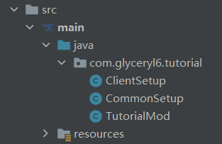
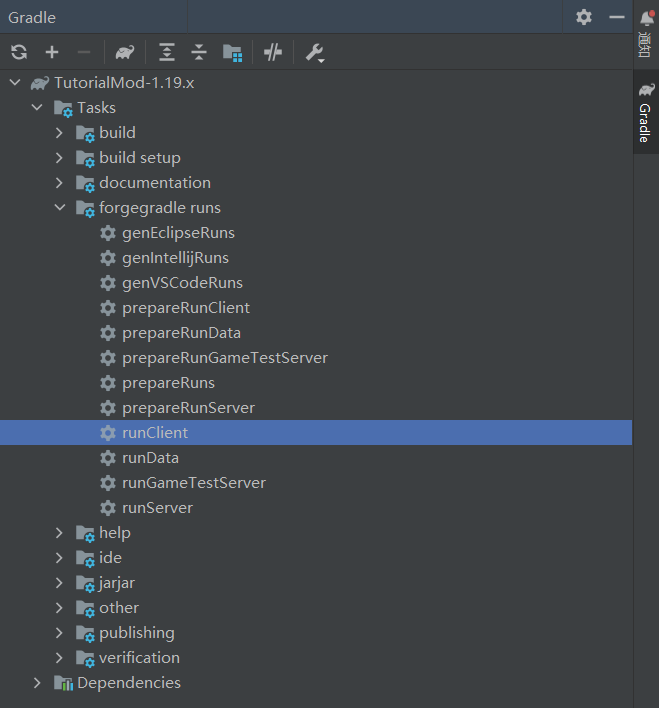
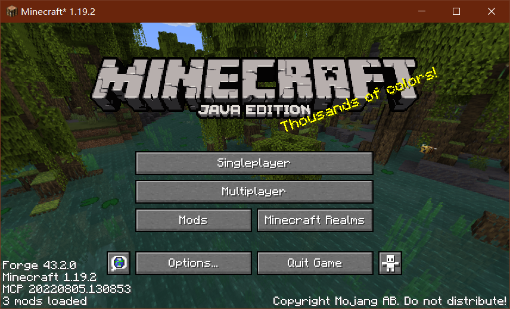

> # 开发环境构建
1. 首先需要下载一份MDK，为了方便，[点击此处可直接下载](https://maven.minecraftforge.net/net/minecraftforge/forge/1.19.2-43.2.0/forge-1.19.2-43.2.0-mdk.zip)；
2. 新建一个空的文件夹，然后将此文件夹改成你模组的英文名称，尽可能不要带有中文，然后将下载好的MDK解压到这个文件夹中，解压完毕后，你会看到以下这些文件：\

3. 将其中的.txt后缀的文件删除掉，因为在后续的开发中是用不到的；
4. 打开idea，依次点击”文件“→”打开“：\

5. 然后找到你刚刚解压的文件夹的目录，选中后点击”确定“：\

6. 确保你的JDK是17以上的版本，如果提示JDK相关的错误，可以通过依次点击”文件“→”项目结构“进行修改，最后别忘了点击”确定“：

7. 如果一切正常，那么项目就会开始进行构建，此时只需静静地等待项目构建完毕即可：\

由于我此前已经构建过其它1.19相关的模组了，所以这里显示的内容并不多，而且构建的速度相对快些，如果是第一次构建的话，可能会稍微久一点。由于国内的复杂的网络环境，实际上整体的构建本身就比较慢，你可能需要一个梯子，具体内容不多赘述，这里提醒你不要忘记配置idea的代理：


> # 项目结构配置
1. 将”ExampleMod“改成你喜欢的名字，建议改成你的模组名，此处我改成了TutorialMod；
2. 将默认的包名也改成你自己的，建议先关闭”压缩中空的软件包“后再进行修改；
3. 打开TutorialMod类，现在将暂时用不到的代码删除掉，删除完毕后如图所示：
```java
@Mod(TutorialMod.MOD_ID)
public class TutorialMod {
    
    //把"examplemod"改成你自己的ModID，用纯英文小写或英文小写+下划线，尽量与Mod名字相关
    public static final String MOD_ID = "gly_tutorial";

    public TutorialMod() {
        IEventBus modEventBus = FMLJavaModLoadingContext.get().getModEventBus();
        MinecraftForge.EVENT_BUS.register(this);
    }
    
}
```
4. 修改了ModID之后，依次点开resources→META-INF→mods.toml，并修改如下内容：
```toml
# 有三处地方需要修改成你的ModID
# 第一处：
modId="gly_tutorial" #mandatory
# 第二处：
# A dependency
[[dependencies.gly_tutorial]] #optional
# 第三处：
# Here's another dependency
[[dependencies.gly_tutorial]]
```
5. 项目的结构本身是比较自由的，但是在此教程中，我们尽可能让Mod的主类小一些，此时我们创建两个类文件：CommonSetup 和 ClientSetup：
   * **对于CommonSetup，写入如下内容**：
   ```java
    @Mod.EventBusSubscriber(bus = Mod.EventBusSubscriber.Bus.MOD)
    public class CommonSetup {

        @SubscribeEvent
        public static void setup(FMLCommonSetupEvent event) {
        
        }
   
    }
   ```
   * **对于ClientSetup，写入如下内容：**
   ```java
   @Mod.EventBusSubscriber(value = Dist.CLIENT, bus = Mod.EventBusSubscriber.Bus.MOD)
   public class CommonSetup {

        @SubscribeEvent
        public static void setupClient(FMLClientSetupEvent event) {
        
        }
        
   }
   ```
6. 此时的文件结构看起来应该是这样的：\

7. 此时点击右侧的Gradle按钮，找到runClient，双击运行：\

8. 如果操作都没什么问题的话，是可以成功加载出游戏画面的：\
