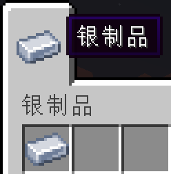

# 创造模式物品栏
当注册完一个物品之后，我们发现，除了能用命令来获取之外，该物品并不能在创造模式的任何一个物品栏中找到。这是因为我们在注册的时候，并没有给它加到物品栏中。
> ## 添加到原版的物品栏中
1. 步骤很简单，只需要在注册的代码中设置一下就行了：
```java
public static final RegistryObject<Item> SILVER_INGOT = ITEMS.register("silver_ingot", () -> new Item(new Item.Properties().tab(CreativeModeTab.TAB_MISC)));
```
后面的`.tab(CreativeModeTab.TAB_MISC)`就是将我们的银锭添加到”杂项“物品栏中。
2. 打开游戏之后，我们找到”杂项“这一栏，就可以在这里面找到我们的”银锭“了。

> ## 添加到自己创建的物品栏中
既然要添加到自己创建的物品栏，那么我们就得先注册一个新的物品栏出来。
1. 新建一个空的类，这里我命名为ModTabs，并往里面添加如下内容：
```java
    //其中的"mod_tab_0"就是这个创造模式物品栏的注册名
    public static CreativeModeTab SILVER_PRODUCTS = new CreativeModeTab("silver_products") {

        @Override
        public ItemStack makeIcon() {
            //这里的物品就是该物品栏显示的图标，这里我用了已经注册好的银锭
            return new ItemStack(ModItems.SILVER_INGOT.get());
        }

    };
```
2. 方法同上，只需要在注册的代码后面添加`.tab(ModTabs.MOD_TAB_0)`就行了：
```java
public static final RegistryObject<Item> SILVER_INGOT = ITEMS.register("silver_ingot", () -> new Item(new Item.Properties().tab(ModTabs.SILVER_PRODUCTS)));
```
3. 由于是自己创建的物品栏，所以需要在语言文件中设置一下本地化，键名跟物品的略有不同：\
`en_us.json`：
```json
"itemGroup.silver_products": "Silver Products"
```
`zh_cn.json`：
```json
"itemGroup.silver_products": "银制品"
```
4. 打开游戏之后，就能够看到一个新的创造模式物品栏，里面还有一个银锭：
