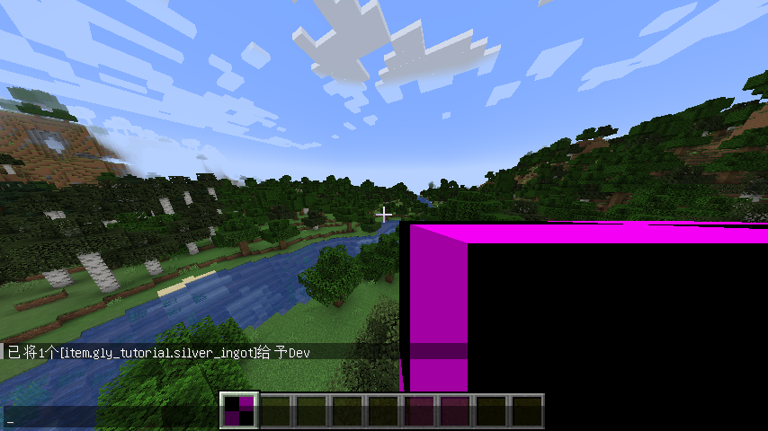
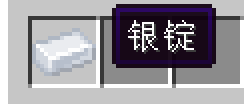
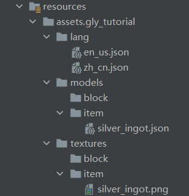

# 第一个物品
## 注册并告知 Forge 实例化
1. 创建一个名为items的包，然后创建一个类，用于注册物品，我这里用的是ModItems，然后往里面添加如下代码：
```java
//其中的"TutorialMod.MOD_ID"改成你的ModID，可以直接写字符串上去，但是为了防止写错，这里建议直接使用Mod主类中的静态String字段。
public static final DeferredRegister<Item> ITEMS = DeferredRegister.create(ForgeRegistries.ITEMS, TutorialMod.MOD_ID);
```
2. 打开Mod的主类，向主方法中添加如下代码：
```java
ModItems.ITEMS.register(modEventBus);
```
3. 此时你的主方法应该长这样：
```java
@Mod(TutorialMod.MOD_ID)
public class TutorialMod {

        public static final String MOD_ID = "gly_tutorial";
    
        public TutorialMod() {
            IEventBus modEventBus = FMLJavaModLoadingContext.get().getModEventBus();
            ModItems.ITEMS.register(modEventBus);
            MinecraftForge.EVENT_BUS.register(this);
        }
}
```

## 开始注册物品
MC中经常用到各种各样的金属锭以及它对应的块，在MC原版中，虽然已经有了金和铜，但是却没有银以及相关的制品，所以我们就以银为案例来展开说明。
1. 回到ModItems类，向其中添加如下注册语句：
```java
//注意：注册名内只允许出现小写字母与下划线
//第二个参数是一个lambda表达式，用来传入物品相关的参数，其中的"new Item.Properties()"就是物品相关的属性，这里并未添加任何的属性。
public static final RegistryObject<Item> SILVER_INGOT = ITEMS.register("silver_ingot", () -> new Item(new Item.Properties()));
```
2. 好了，一个简单的物品已经注册好了，此时你的ModItems类中的内容应该是这样子的：
```java
public class ModItems {

    public static final DeferredRegister<Item> ITEMS = DeferredRegister.create(ForgeRegistries.ITEMS, TutorialMod.MOD_ID);
    public static final RegistryObject<Item> SILVER_INGOT = ITEMS.register("silver_ingot", () -> new Item(new Item.Properties()));
}
```
3. 打开游戏，输入命令：/give @p gly_tutorial:silver_ingot 就会得到一个没有贴图的紫黑块，同时也没有对应的本地化名字：\


# 模型与纹理
由于我们并未给该物品添加模型与纹理，所以它只会显示如上图一样的紫黑块。
1. 先在`resources`目录下创建`assets/{你的modid}/models/item`文件夹，然后在该文件夹中创建`silver_ingot.json`文件；
2. 要写入什么内容？我们可以快速按两下`Shift`键，输入`iron_ingot.json`，打开它，会发现如下的内容：
```json
{
      "parent": "minecraft:item/generated",
      "textures": {
        "layer0": "minecraft:item/iron_ingot"
      }
}
```
3. 将这些内容复制粘贴到`silver_ingot.json`内，然后稍微改动一下：
```json
{
      "parent": "minecraft:item/generated",
      "textures": {
        "layer0": "gly_tutorial:item/silver_ingot"
      }
}
```
最后再将`silver_ingot.png`放到`assets/{你的ModID}/textures/item`下。\
参数说明：\
`parent`：表示继承的模型，这里的是原版的`minecraft:item/generated`，对应的目录就是`assets/minecraft/models/item/generated`\
`textures`：定义了这个模型使用的纹理，`layer0`部分对应的路径就是`assets/gly_tutorial/textures/item/silver_ingot.png`，同时`layer0`也代表了该物品只有一层纹理，而原版的一些物品，例如刷怪蛋、药水等，还会看到多了个`layer1`，它们都有双层纹理。

#### **更详细的参数说明可以上 [Wiki](https://minecraft.fandom.com/zh/wiki/%E6%A8%A1%E5%9E%8B) 进行查看。**

# 语言文件与本地化
虽然物品已经有了纹理，但是我们仍不能在游戏中看到它的正确名字，所以我们需要添加一个语言文件。**对于语言文件，不仅仅是物品需要用到，在后面的方块、实体等部分，也需要用到。**
1. 我们在`assets/{你的ModID}/`下创建一个`lang`文件夹，然后分别在里面创建`en_us.json`和`zh_cn.json`；
2. 在`en_us.json`写入如下内容：
```json
{
      //其中item表示这个东西是个物品，中间的参数是你的ModID，右边的参数是该物品的注册名
      "item.gly_tutorial.silver_ingot": "Silver Ingot"
}
```
3. 在`zh_cn.json`中写入如下内容：
```json
{
      "item.gly_tutorial.silver_ingot": "银锭"
}
```

#### **此时我们打开游戏，就能够看到我们的物品已经有了对应的纹理和本地化名字:**

#### **如果没能成功加载出贴图或没有显示对应的本地化名字，可以参考一下文件结构，看看有什么地方做错了:**


### 恭喜你，你已经学会如何添加物品了！