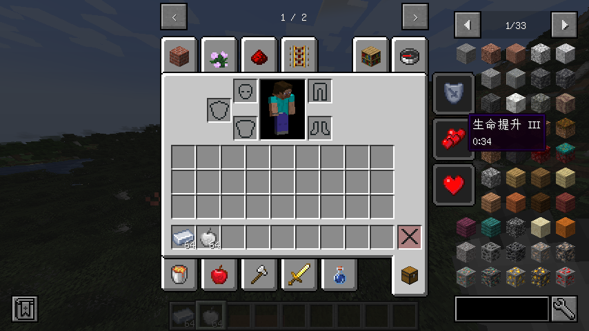

# 食物
和很多人想象的不一样，食物并不是单独的一个东西，对于Minecraft来说，食物只是一种特殊的物品而已。相较于普通的物品，它多了一些与食物相关的属性。

在本篇教程里，我们将会向Minecraft世界中添加一种新的食物：银苹果。吃了它之后，会恢复一定的饥饿值和饱和度，同时还会获得一定时间和等级的抗性提升、生命提升和生命恢复的效果。

1. 和普通的注册物品的方式一样，先注册一个“银苹果”物品，在ModItems中添加如下代码：
```java
public static final RegistryObject<Item> SILVER_APPLE = ITEMS.register("silver_apple", () -> new Item(new Item.Properties().tab(ModTabs.SILVER_PRODUCTS)));
```
2. 然后给它加上食物相关的属性，并给它增加一些状态效果：
```java
    public static final RegistryObject<Item> SILVER_APPLE = ITEMS.register("silver_apple", () -> new Item(new Item.Properties()
            .tab(ModTabs.SILVER_PRODUCTS).food((new FoodProperties.Builder()).nutrition(10).saturationMod(1.5F)
                    .effect(() -> new MobEffectInstance(MobEffects.DAMAGE_RESISTANCE, 600, 3), 1.0F)
                    .effect(() -> new MobEffectInstance(MobEffects.HEALTH_BOOST, 1200, 2), 1.0F)
                    .effect(() -> new MobEffectInstance(MobEffects.REGENERATION, 2400, 1), 1.0F)
                    .alwaysEat().build())));
```

在上述代码中，我们给它的**饥饿值**设置为10，**饱和度**设置为1.5F，这两个数值的具体含义可查看 [Wiki](https://wiki.biligame.com/mc/%E9%A3%9F%E7%89%A9)，

与此同时，我们还给它增加了一些效果：30秒的抗性提升效果，等级为4；60秒的生命提升，等级为3；120秒的生命恢复，等级为2。\
对于效果的持续时间，单位是刻，比如600对应600÷20=30秒；对于效果的等级，设置为0的时候是1级，1的时候是2级，以此类推。\
这里还给它添加了一个`alwaysEat()`属性，表示玩家在吃饱的时候还能继续进食。

最右边的1.0F是吃了该食物后，触发该效果的概率，这里设置成了1.0F，对应100%触发该效果。

3. 然后给它添加贴图、模型和对应的本地化翻译即可，就跟普通的物品一样；
4. 进入游戏，然后尝试食用，就会获得对应的状态效果：
